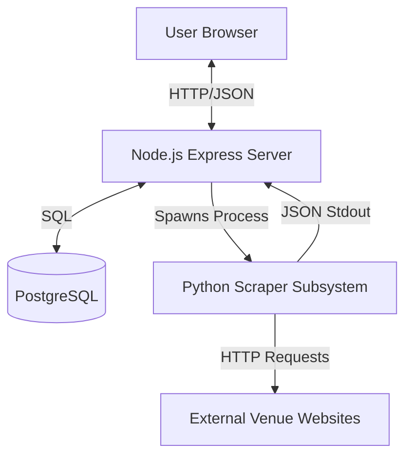
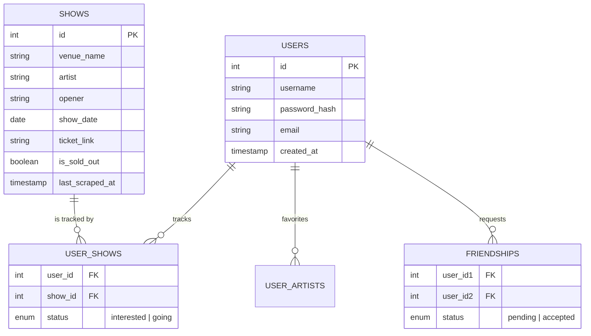
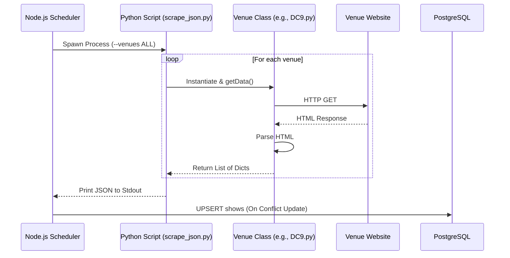

# System Architecture

## Overview

The application follows a **Monolithic** architecture with a clear separation between the Node.js web server, the Python scraping subsystem, and the PostgreSQL database.

## 🗄️ Database Schema

The application uses **PostgreSQL** for persistence. The schema is initialized automatically in `server.js` on startup.

## 🕷️ Scraping Pipeline

The scraping system is a hybrid Node.js/Python implementation.

1.  **Trigger:** The `server.js` triggers a scrape operation on startup and then every **6 hours**.
2.  **Execution:** Node.js spawns a child process executing `scraping/scrape_json.py`.
3.  **Collection:** The Python script imports venue-specific classes (e.g., `NineThirty.py`, `DC9.py`), fetches their HTML, and parses the show data.
4.  **Output:** The Python script outputs a single JSON object to `stdout`.
5.  **Ingestion:** Node.js captures the `stdout`, parses the JSON, and performs an **UPSERT** (Insert or Update) into the `shows` table based on a composite unique key (`venue_name`, `artist`, `day`, `month`).

