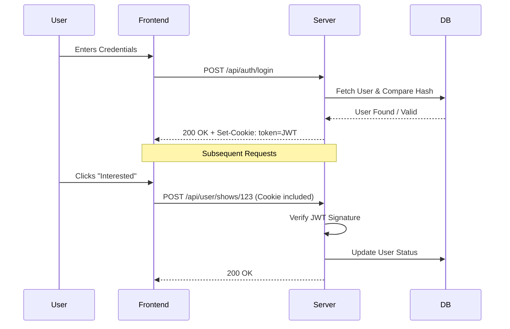

# Authentication & Security

## 🔐 Overview

The application uses **JWT (JSON Web Tokens)** for stateless authentication.

## 🌊 Auth Flow

1.  **Login:**
    *   User sends credentials to `POST /api/auth/login`.
    *   Server verifies hash (using `bcryptjs`).
    *   Server signs a JWT containing `{ id, username }`.
    *   Server sets the JWT in an **HTTP-only, Secure (if https)** cookie named `token`.
    *   **Crucial:** The frontend *cannot* read this cookie via JavaScript (preventing XSS token theft).

2.  **Protected Requests:**
    *   Browser automatically includes the `token` cookie in requests to `/api/...`.
    *   Express middleware (`authenticateToken` in `server.js`) intercepts the request.
    *   It verifies the signature. If valid, it attaches `req.user` and allows the request.

3.  **Logout:**
    *   `POST /api/auth/logout` instructs the browser to clear the cookie.

## 🛡️ Security Measures

*   **Password Hashing:** Passwords are never stored in plain text. `bcryptjs` is used with a salt work factor of 10.
*   **HttpOnly Cookies:** Prevents client-side scripts from accessing the sensitive session token.
*   **SQL Injection Protection:** All database queries use **parameterized queries** (e.g., `Values ($1, $2)`), preventing injection attacks.
*   **XSS Protection:** The frontend helper `escHtml` manually escapes special characters before injecting HTML strings, preventing Cross-Site Scripting.
