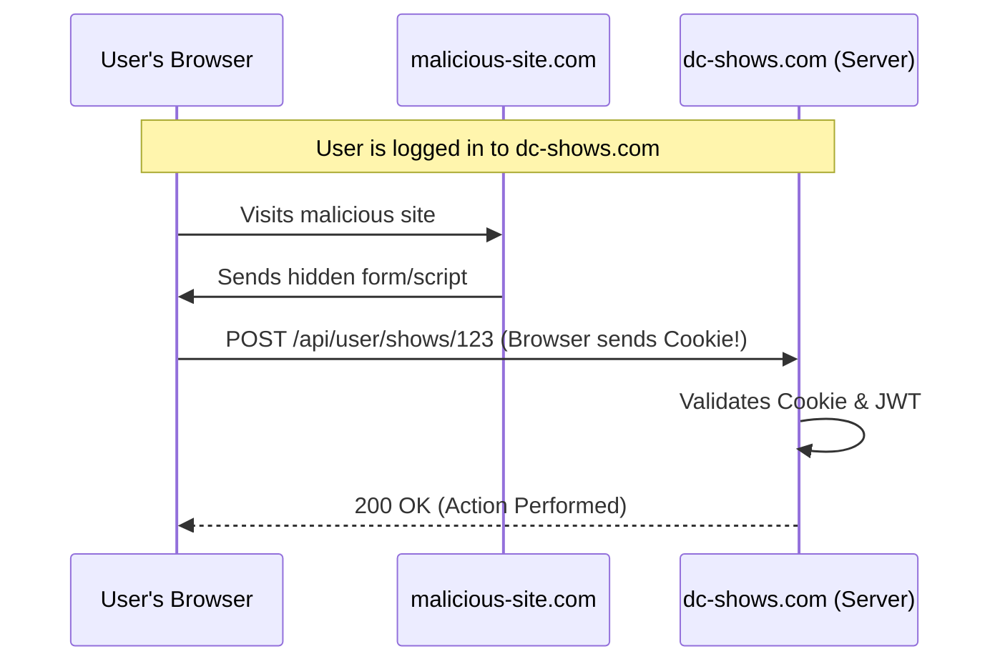
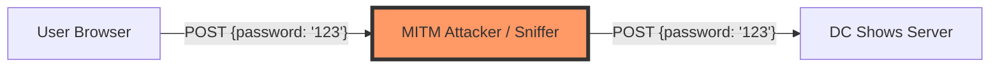

# Security Audit & Hardening Guide

This document outlines the security posture of the **DC Shows** application, identifies potential vulnerabilities, and provides a roadmap for hardening the system against common web attacks.

## 🛡️ Security Overview

The application implements several baseline security features:
*   **Password Hashing:** Uses `bcryptjs` with a salt factor of 10.
*   **Stateless Auth:** Uses JWT (JSON Web Tokens).
*   **Secure Cookies:** JWTs are stored in `HttpOnly` cookies to prevent XSS-based token theft.
*   **Parameterized Queries:** Prevents SQL Injection by using `pg`'s built-in parameterization.

---

## 🚨 Critical Vulnerabilities

### 1. Cross-Site Request Forgery (CSRF)
Since the application relies on cookies for authentication, it is vulnerable to CSRF. An attacker can craft a malicious website that triggers authenticated actions on behalf of a logged-in user.

**Recommendation:** Implement CSRF protection using a "Double Submit Cookie" pattern or a dedicated middleware like `csurf`.

### 2. Transport Security (MITM)
In its current state (HTTP), all data—including registration and login passwords—is sent in **cleartext**.

**Recommendation:** Deploy the application behind a reverse proxy (Nginx/Caddy) with **TLS/SSL (HTTPS)**. Enable HSTS headers.

---

## ⚠️ High-Risk Findings

### 1. Lack of Rate Limiting
The `/api/auth/login` and `/api/auth/register` endpoints are unprotected against brute-force attacks. An attacker could automate thousands of attempts per minute.
*   **Recommendation:** Implement `express-rate-limit` for all `/api/auth/` routes.

### 2. Potential Persistent XSS
The frontend uses `.innerHTML` to render data fetched from the database. While the server-side scraper is currently trusted, a compromised venue website could inject malicious scripts into show titles or artist names.
*   **Recommendation:**
    *   Switch from `.innerHTML` to `.textContent` for all dynamic data.
    *   Use a sanitization library like `DOMPurify` for any required HTML.

---

## ⚙️ Hardening Roadmap

| Task | Priority | Description |
| :--- | :--- | :--- |
| **Install Helmet** | High | Set security headers (`X-Frame-Options`, `CSP`, etc.) |
| **Enable HTTPS** | High | Use Let's Encrypt for all production traffic. |
| **Rate Limiting** | Medium | Limit auth attempts to 5 per minute per IP. |
| **CSRF Protection** | Medium | Add CSRF tokens to all state-changing requests. |
| **Least Privilege** | Low | Use a non-root user for the Docker container and DB user. |

## 🧪 Security Testing
To verify these improvements, use tools like:
*   `npm audit`: Check for vulnerable dependencies.
*   `OWASP ZAP`: Automated vulnerability scanning.
*   `Burp Suite`: Manual interception and testing of API endpoints.
